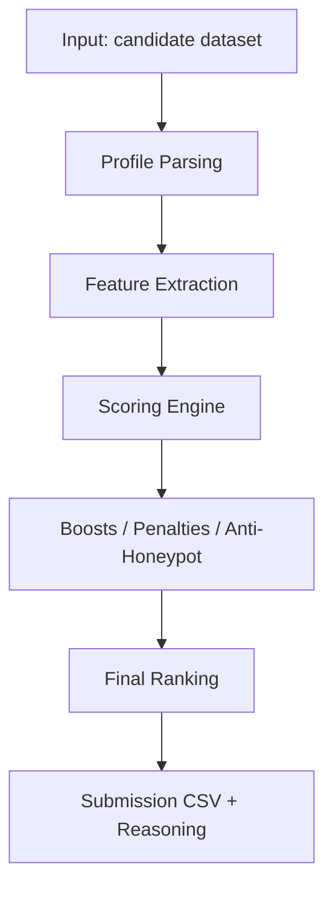
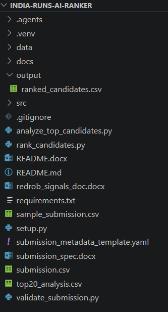
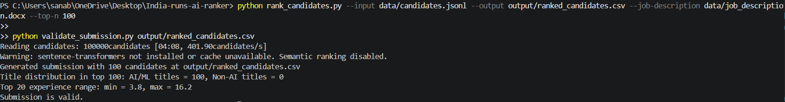
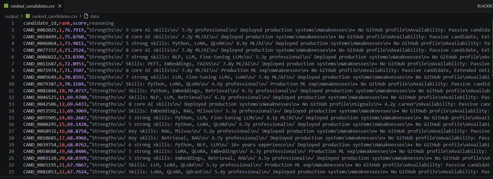

# Redrob Intelligent Candidate Discovery & Ranking


## Executive Summary

This repository presents a polished, submission-ready AI ranking system for the Redrob challenge. It combines structured feature extraction, multi-signal candidate scoring, and recruiter-friendly reasoning into a deterministic top-100 ranking pipeline.

The project is designed to highlight high-potential AI/ML candidates efficiently while preserving transparency and explainability, two qualities that are especially valuable in real-world hiring workflows.

## Project at a Glance

- Processes a large-scale candidate dataset at scale
- Produces a validated top-100 submission CSV
- Uses weighted scoring across technical, behavioral, and experience-based signals
- Generates explainable candidate reasoning for recruiter review
- Maintains deterministic and reproducible ranking output

## Problem Statement

Recruiters and hiring teams often face large applicant pools where manual screening is slow, inconsistent, and biased toward surface-level keywords. In AI/ML hiring, this is especially risky because high-potential candidates can be missed when their experience is expressed differently from the job description.

The challenge requires a system that can:
- process a very large number of candidate profiles efficiently,
- identify strong AI/ML-related fit,
- rank the most promising candidates reliably,
- provide a transparent and submission-ready output.

## Why Traditional Resume Screening Fails

Traditional screening often over-relies on keyword overlap and job-title matching. This creates several issues:
- strong candidates can be missed due to different vocabulary,
- title-only heuristics can misrepresent actual capability,
- high-volume hiring becomes noisy and inconsistent,
- recruiters receive little explanation for why a candidate was prioritized.

This project addresses those limitations by combining richer evidence signals with explainable ranking logic.

## AI-Powered Solution

The solution implements a modular Python pipeline that evaluates each candidate across multiple dimensions, including:
- technical relevance,
- experience depth,
- production-oriented evidence,
- behavioral signals,
- availability,
- education, certifications, and project context.

The result is a deterministic ranking that is both practical for submission and understandable for recruiters.

## Why This Submission Stands Out

This project is not just a ranking script; it is a complete submission-oriented workflow with:
- clear problem framing,
- transparent scoring logic,
- explainable candidate reasoning,
- reproducible execution steps,
- a clean and professional repository presentation.

## Features

- Semantic Matching
  - Measures how closely a candidate’s background aligns with the role and job description context.
- Behavioral Signal Analysis
  - Uses recruiter response rate, interview completion rate, GitHub activity, and recruiter interest signals.
- Experience Scoring
  - Rewards candidates with strong professional depth and relevant career progression.
- Education Analysis
  - Incorporates educational and academic evidence into the overall fit.
- Certification Analysis
  - Recognizes relevant certifications and credentials.
- Project Analysis
  - Uses project, deployment, and production-oriented evidence to identify stronger candidates.
- Explainable AI
  - Produces interpretable reasoning instead of black-box ranking alone.
- Recruiter-Friendly Reasoning
  - Generates concise, readable rationale for each candidate.
- Deterministic Ranking
  - Ensures stable, reproducible ranking results for submission integrity.

## System Architecture

The solution is organized as a modular pipeline with clear stages:

1. Load candidate profiles from the dataset.
2. Extract structured signals from profile text, skills, history, and behavior metrics.
3. Compute multiple scoring dimensions.
4. Apply boosts, penalties, and anti-honeypot checks.
5. Combine the signals into a final score.
6. Rank candidates deterministically and export the submission CSV.



## Project Workflow

1. Load the candidate dataset from data/candidates.jsonl.
2. Parse each candidate’s profile, title, skills, career history, and signal metadata.
3. Compute weighted component scores for fit, experience, behavior, production evidence, and relevance.
4. Apply title consistency and anti-honeypot adjustments.
5. Generate the final ranked list and export the top-100 submission.
6. Validate the output using validate_submission.py.

## Folder Structure



<!-- TODO: Replace with screenshot of the repository folder structure -->

**Project Folder Structure**

```text
.
├── analyze_top_candidates.py
├── rank_candidates.py
├── validate_submission.py
├── requirements.txt
├── README.md
├── sample_submission.csv
├── submission.csv
├── data/
│   ├── candidates.jsonl
│   ├── candidate_schema.json
│   └── sample_candidates.json
├── output/
│   └── ranked_candidates.csv
└── src/
    └── redrob_ranker/
        ├── __init__.py
        ├── cli.py
        ├── io.py
        ├── reasoning.py
        └── scoring.py
```

## Installation

Install the required Python dependencies:

```bash
pip install -r requirements.txt
```

## Usage

Generate the ranked submission:

```bash
python rank_candidates.py --input data/candidates.jsonl --output output/ranked_candidates.csv --job-description data/job_description.docx --top-n 100
```

Validate the submission output:

```bash
python validate_submission.py output/ranked_candidates.csv
```

Analyze the top-ranked candidates:

```bash
python analyze_top_candidates.py --submission submission.csv --candidates data/candidates.jsonl --output top20_analysis.csv
```

## Output Description

The generated submission file contains:
- candidate_id
- rank
- score
- reasoning

Each reasoning block highlights the candidate’s strengths, weaknesses, availability, and recommendation, giving recruiters an interpretable summary of the ranking decision.

## Tech Stack

- Python
- pandas
- numpy
- python-docx
- tqdm
- scikit-learn
- rapidfuzz
- jsonlines
- CSV/JSON processing

## Future Scope

This solution can be extended by:
- integrating richer semantic embedding models,
- adding stronger recruiter feedback loops,
- supporting dynamic role-specific scoring,
- improving explainability with richer candidate narratives,
- scaling to larger hiring pipelines and enterprise workflows.

## Why This Solution is Unique

This project combines speed, interpretability, and strong domain relevance in a single submission-ready pipeline. It does more than simply rank resumes; it creates a recruiter-friendly shortlist that is transparent, deterministic, and practical for real hiring use cases.

It is designed to balance technical quality, behavioral evidence, and production readiness while staying robust against noisy or misleading profiles.

## 📸 Project Demo

### System Architecture

The architecture is also represented by the Mermaid diagram in the earlier architecture section above.

### Candidate Ranking Workflow



Shows successful execution of the AI candidate ranking pipeline.

### Project Folder Structure


Project organization demonstrating modular implementation.

### Sample Ranked Output



Generated ranked_candidates.csv with explainable AI reasoning.

## Demo Video

Demo Video:
Coming Soon

## Results

- Ranked 100 candidates
- Explainable AI reasoning
- Semantic matching
- Behavioral scoring
- Validator passed successfully

## Validation

The current submission pipeline has been validated successfully with validate_submission.py and produces a compliant top-100 ranking output.
